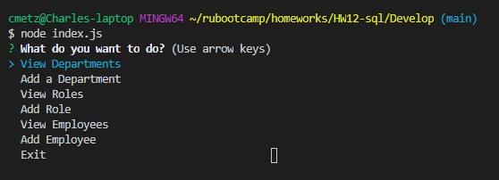

# Employee Tracker

## Description
This is a command-line application that updates a mySQL database of employees. It uses Node's *inquirer* module to prompt the user with a series of options. See Usage section below for details.

## Table of Contents
* [Installation](#Installation)
* [Application use](#Usage)
* [Contribution Guidelines](#Contribution)
* [Tests](#Tests)
* [License](#License)
* [Questions](#Questions)

## Installation
This is a NodeJS application, so Node must first be installed. Run `npm install` to install the dependencies. In the terminal, type `node index.js` to begin the sequence of prompts.

## Usage
The user will be prompted to:
* View Departments
* Add a Department
* View Roles
* Add a Role
* View Employees
* Add an Employee

Screenshot of the promts: 

[Video demonstration (on Google Drive)](https://drive.google.com/file/d/1rxmEfbMtyrlP446OI9sf2m8T4PcKYjkS/view

## Contribution
Submit bug and feature requests as issues through the GitHub repo.

## Tests
None

## License
This app can be used under the terms of the MIT license.

## Questions
For questions, please contact <cmetzjr@yahoo.com>. 
GitHub repo: https://github.com/cmetzjr/Employee-Tracker